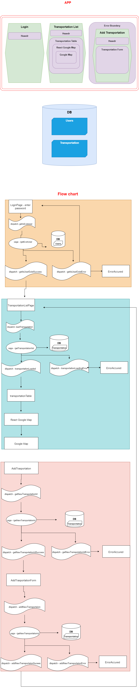

## React Transportation Project
created by Hodaya Farkash  ❤️
 

#### Features
This Project developed to manage transportations information.
It contains data about transportations and the users allow to view them.

The project built based on react best practise features.

Every user would be able to login with correct password.
Successfull login will transfer the user aoutomaticlly to transportation list.
on transportation list page he would be able to see all transportations and there details.
Clicking on transportation would open google map with the route.
In addition - the user would be able to add transportation, the user will type physical address and the data will be saved as cordinates.

The project would'nt include:
edit transportation, delete transportation and any user handle.

In the bellow you can see project architecture.

 